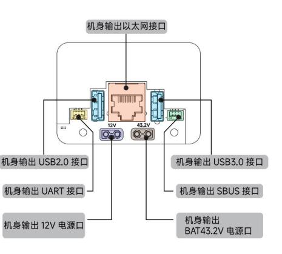
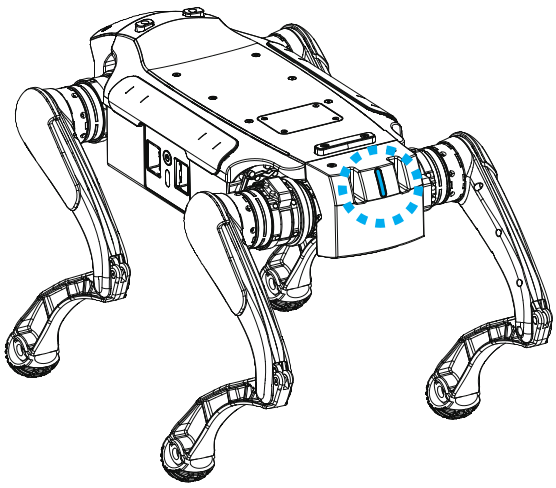

1.5 电气拓展接口
================

| 序号 | 接口名称 | 数量 | 说明                                     |
|------|--------|------|-----------------------------------------|
| 1    | 以太网口 | 1    | RJ45 接口，支持 1000Mbps 传输速率，用于高速数据传输，支持网络连接、远程监控、数据传输等应用 |
| 2    | USB接口  | 2    | Type\_A 接口，用于连接外部存储设备、摄像头、传感器等 USB 设备，提供高速数据传输和电力供应     |
| 3    | 电源接口 | 2    | 标准 DC 电源接口，提供稳定的电源供应，支持 12V 和 BAT 输出  12V 输出总功率不高于 36W，BAT 输出总功率不高于 100W，满足机器人及上装设备的电力需求。  对插接口型号是 XT30U-M                   |
| 4    | SBUS接口 | 1    | 标准 SBUS 接口，用于连接遥控器接收器或其他支持 SBUS 协议的通信设备，实现精确的遥控指令传输   |
| 5    | UART接口 | 1    | 标准 UART 接口，用于连接嵌入式系统、通信设备或其他支持 UART 协议的设备  通过异步串行通信实现设备间的数据交换与控制 |

