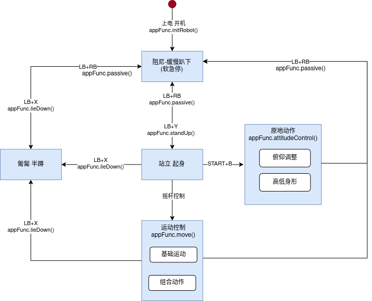
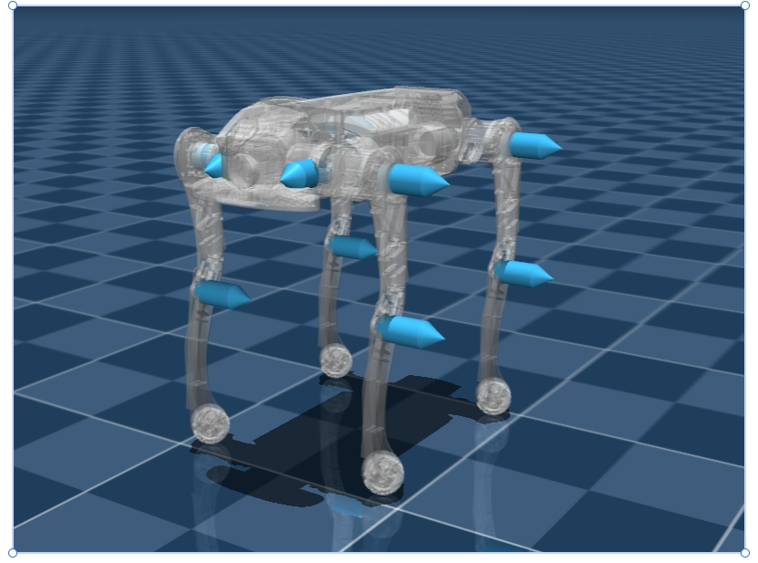

3.10 二开控制说明
=================

指令下发需要按照以下状态跳转逻辑，否则可能会造成机器摔倒、故障、不响应等异常情况。

3.10.1 关节控制命令说明
-----------------------

命令顺序

-   FR（右前）
-   FL（左前）
-   RR（右后）
-   RL（左后）

3.10.2 关节方向定义
-------------------

A，H，K 关节坐标系：前 X， 左 Y， 上 Z 
坐标方向符合右手坐标系，前向为 X 正方向，左为 Y 正方向，上为 Z 正方向 
腿的顺序前右前左，后右后左

**使用 sdk 控制时，需要加入低电量预警逻辑，当四足机器人电不足时，sdk 连接会自动断开，在进行上层 sdk 控制时，需加入对应的处理逻辑**
