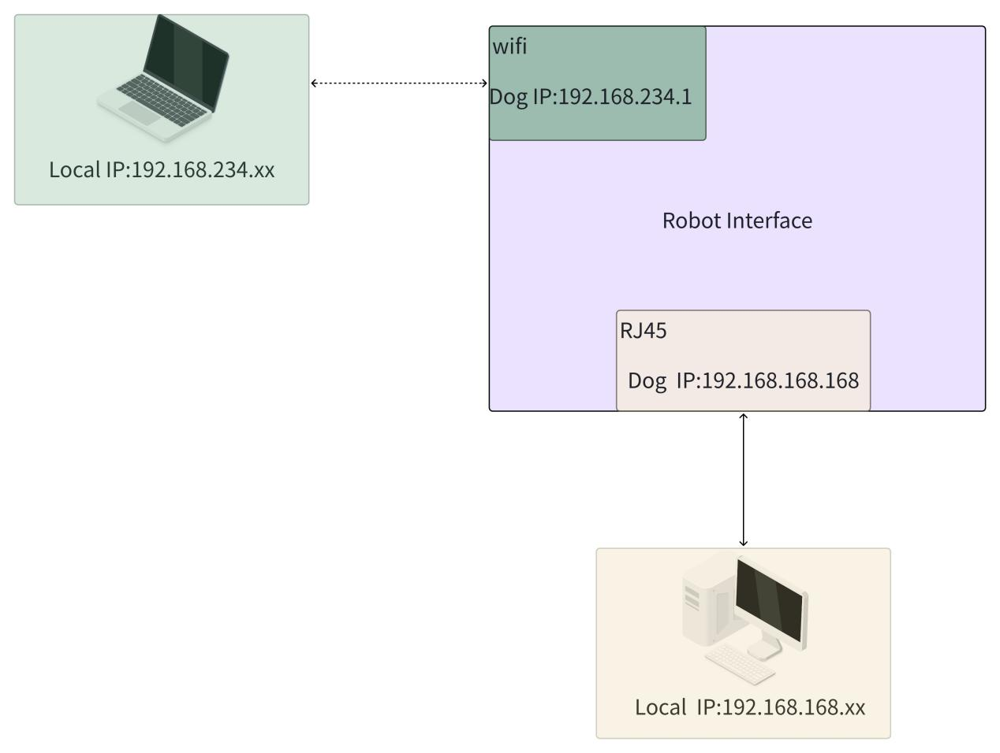

3.3 网络连接
============

设备上配备无线网络与有线网络接口，其中无线网络信息位于设备右侧或腹部标签，标签内标注有设备
SSID 与密码信息，机器人本体默认 IP 如下表：

|网络接口    | IP地址          |DHCP  |
|----------|-----------------|------|
| 无线网络 | 192.168.234.1 |   有  |
| 有线网络 | 192.168.168.168 |  无  |

-   无线网络配备 DHCP 服务，连接上无线网络后，确保操作设备无线网络未配置固定 IP，可以直接通 192.168.234.1 与机器人建立通讯。
-   有线网络不配备 DHCP服务，通过有线连接后，需要再操作设备有线网络配置固定 IP，且 IP 为 168 网段，即可与机器人建立通讯。

