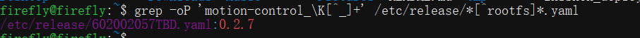

3.5 固件版本号查询
==================

登录设备后，执行以下命令查看当前设备版本：

```
grep -oP 'motion-control_\K[^_]+' /etc/release/*[^rootfs]*.yaml
```



-   以上图为例：602002057TBD.yaml：0.2.7
-   固件版本号：第 567 位， 即固件为 2.0.5
-   sdk 版本号： 输出内容，即运控版本为 0.2.7

**若命令执行后版本号低于 0.2.6，则说明设备版本过低，需要联系售后进行升级。**  
**本文档适用于 SDK 版本 0.2.6 及以上版本，若低于此版本，请联系售后技术人员发送最新版本固件包进行升级**  
**0.3.4 以下版本机器： sdk 控制期间，遥控器无法使用**  
**0.3.4 及以上版机器人：sdk 控制期间，可切换控制权，实现遥控器 sdk 控制权的切换控制**  
