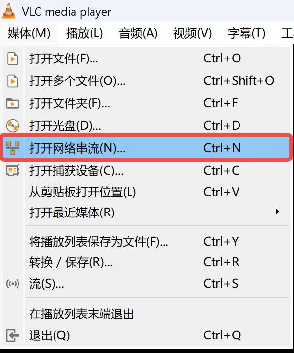
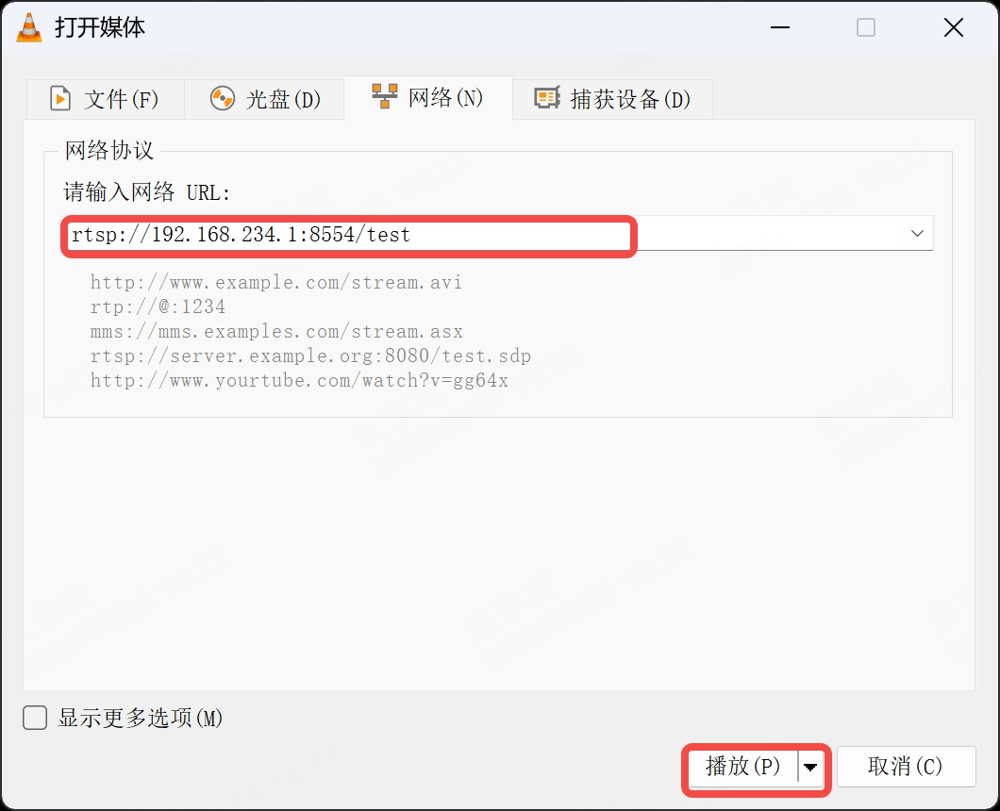
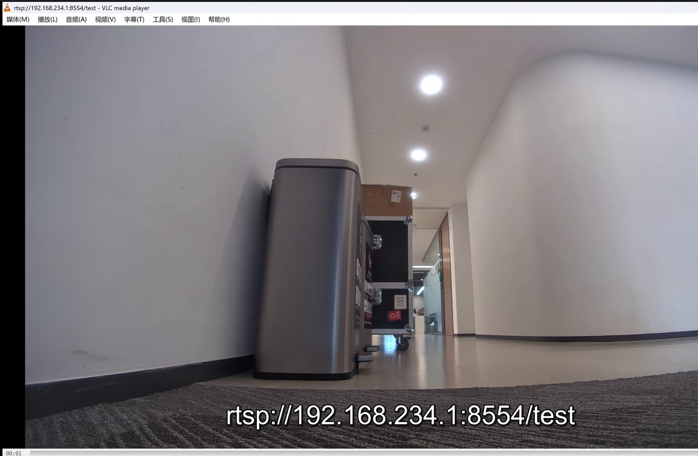
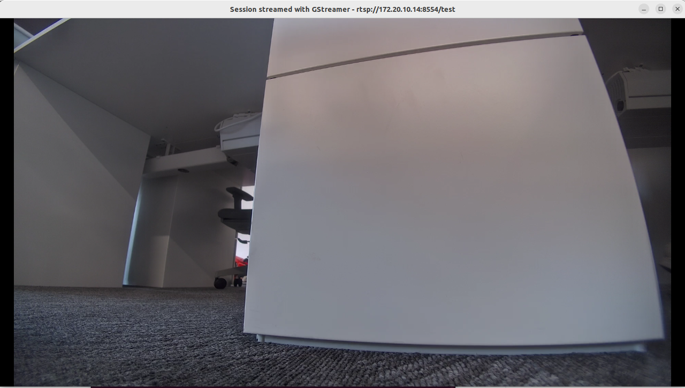

5.1 视频流推送服务
==================

四足机器人广角相机的视频以 Gstreamer 方式推流到以下 URL:

```
rtsp://192.168.234.1:8554/test      #无线连接方式
rtsp://192.168.168.168:8554/test    #有线连接方式
```

默认会在遥控器侧拉流显示实时画面，可通过 VLC 或者 ffplay 进行预览和调用，例如：

5.1.1 VLC查看
--------------------------------------------------------------------------------------

在 windows 电脑连接四足机器人 wifi，可通过 VLC 软件进行视频流查看

step1:打开 vlc，点击\"媒体\--\>打开网络串流\"



step2:输入设备推流地址：



step3:预览画面



5.1.2 通过ffmpeg获取视频流
--------------------------------------------------------------------------------------

在安装了ffmpeg的设备上执行以下命令可直接获取本体相机的视频流

```shell
ffplay rtsp://192.168.234.1:8554/test
```

```shell
ffplay -rtsp_transport tcp -fflags nobuffer -flags low_delay -framedrop -strict \
experimental -probesize 32 -analyzeduration 0 -sync ext rtsp://192.168.234.1:8554/test
```

5.1.3 通过GStreamer获取视频流
--------------------------------------------------------------------------------------

安装GStreamer后安装以下插件

```shell
sudo apt install -y gstreamer1.0-tools \
                    gstreamer1.0-plugins-base \
                    gstreamer1.0-plugins-good \
                    gstreamer1.0-plugins-bad \
                    gstreamer1.0-plugins-ugly \
                    gstreamer1.0-libav
```

- gstreamer1.0-tools：包含 gst-launch-1.0 等核心工具
- gstreamer1.0-plugins-base：基础插件（如 autovideosink）
- gstreamer1.0-plugins-good：常用插件（如 rtph264depay）
- gstreamer1.0-plugins-bad：实验性插件（如 rtspsrc）
- gstreamer1.0-plugins-ugly：特殊编码器（如 mpeg）
- gstreamer1.0-libav：FFmpeg 相关插件。

插件安装后执行以下命令获取本体相机的视频流

```shell
gst-launch-1.0 rtspsrc location=rtsp://192.168.234.1:8554/test latency=0 ! rtph264depay \
! h264parse ! avdec_h264 ! videoconvert ! videoscale ! video/x-raw,width=1280,height=720 ! autovideosink
```

5.1.4 通过OpenCV获取视频流
--------------------------------------------------------------------------------------

安装OpenCV后，执行以下代码获取本体相机的视频流

```python
import cv2
import time

def read_rtsp_Stream(rtsp_url):
    # 1. 初始化视频捕获，强制使用TCP
    cap = cv2.VideoCapture(rtsp_url + "?tcp")  # 尝试TCP传输
    
    # 2. 降低缓冲区大小
    if hasattr(cv2, 'CAP_PROP_BUFFERSIZE'):
        cap.set(cv2.CAP_PROP_BUFFERSIZE, 1)  # 缓冲区只保留1帧
    
    # 3. 禁用硬件加速
    if hasattr(cv2, 'CAP_PROP_HW_ACCELERATION'):
        cap.set(cv2.CAP_PROP_HW_ACCELERATION, cv2.VIDEO_ACCELERATION_NONE)
    
    if not cap.isOpened():
        print(f"无法打开流: {rtsp_url}")
        # 若TCP失败，尝试默认协议
        cap = cv2.VideoCapture(rtsp_url)
        if not cap.isOpened():
            print("所有协议均无法打开流，退出")
            return
    
    # 4. 循环读取，只取最新帧（跳过旧帧）
    while True:
        # 连续读取多次，丢弃中间帧，只保留最后一帧（最新帧）
        # 这一步可解决缓冲区累积的旧帧问题
        for _ in range(3):  # 尝试读取3次，确保拿到最新帧
            ret, frame = cap.read()
            if not ret:
                break
        
        if not ret:
            print("流中断，尝试重连...")
            time.sleep(1)
            cap = cv2.VideoCapture(rtsp_url + "?tcp")
            if hasattr(cv2, 'CAP_PROP_BUFFERSIZE'):
                cap.set(cv2.CAP_PROP_BUFFERSIZE, 1)
            continue
        
        # 5. 缩小分辨率（可选，降低显示和传输压力）
        frame = cv2.resize(frame, (1280, 720))  # 根据需求调整
        
        # 显示帧
        cv2.imshow("RTSP Stream (按q退出)", frame)
        
        # 检测退出
        if cv2.waitKey(1) & 0xFF == ord('q'):
            break
    
    cap.release()
    cv2.destroyAllWindows()

if __name__ == "__main__":
    rtsp_url = "rtsp://192.168.234.1:8554/test" 
    read_rtsp_Stream(rtsp_url)
    
```

5.1.5 通过OpenCV使用GStreamer获取视频流
--------------------------------------------------------------------------------------

安装OpenCV和GStreamer后，执行以下代码获取本体相机的视频流

```python

import cv2
import time

def read_rtsp_gstreamer(rtsp_url):  
    # 构建GStreamer管道
    pipeline = (
        f'rtspsrc location={rtsp_url} latency=0 ! '
        'rtph264depay ! avdec_h264 ! '
        'videoconvert ! video/x-raw,format=BGR ! '
        'appsink sync=false drop=true max-buffers=1'
    )

    # 创建GStreamer捕获对象
    cap = cv2.VideoCapture(pipeline, cv2.CAP_GSTREAMER)
    
    if not cap.isOpened():
        print("无法打开GStreamer管道")
        return
    
    try:
        while True:
            ret, frame = cap.read()
            if not ret:
                print("读取帧失败")
                break
                
            # 显示帧
            cv2.imshow("GStreamer Low Latency", frame)
            
            if cv2.waitKey(1) & 0xFF == ord('q'):
                break
                
    finally:
        cap.release()
        cv2.destroyAllWindows()
if __name__ == "__main__":
    rtsp_url = "rtsp://192.168.234.1:8554/test"
    read_rtsp_gstreamer(rtsp_url)
```

5.1.6 优化视频流延迟
--------------------------------------------------------------------------------------

直接获取视频流进行展示，可能存在画面延迟问题，这种情况需要优化视频流获取参数，如调整缓冲区大小、禁用硬件加速等。  
在设备屏幕遥控器上获取同样的视频流，展示的视频流效果已经做到较低的延迟。  
使用上方的GStreamer获取视频流，也有较低的延迟，这并非是机器端推送的视频流存在延迟。  
也可以选择如大牛直播SDK等针对性做过优化的程序进行播放。

5.1.7 连接外部wifi
--------------------------------------------------------------------------------------

连接外部局域网wifi，获取到本地IP之后，使用合适的IP进行视频流获取：

```
ffplay rtsp://172.20.10.14:8554/test
```

