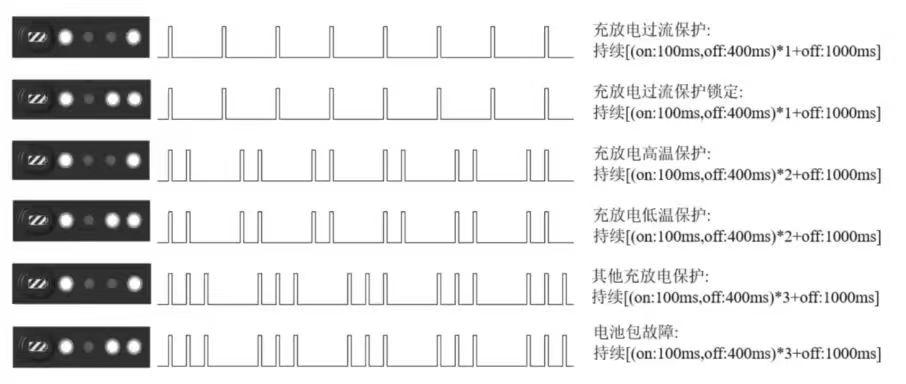

5.2 指示灯说明
=============

5.2.1 四足机器人尾灯说明
------------------------

| 灯光       |灯语                     |备注 |
|-----------|-------------------------|--------|
| 蓝色常亮   | 开机完成                 | 正常状态 |
| 蓝色闪烁   | 开机中                   | 启动失败，常见于使用有线连接运行 sdk 后，未进行 IP 配置的恢复 |
| 白色常亮   | 实验室模式               | 此模式下可使用特技动作 |
| 绿灯常亮   | sdk控制模式              | 使用控制权切换功能并处于sdk控制模式 |
| 黄灯常亮   | 电池电量低于 20%         | 电池电量不足，无法开启狂暴模式，无法进行 sdk 控制 |
| 黄灯闪烁   | 电池电量低于 5%          | 电池电量不足，需立即充电 |
| 红灯常亮   | 关节温度过高，需要冷却     |                  |
| 红灯闪烁   | 系统异常                 | 需要联系售后排查 |

5.2.2 电池指示灯说明
--------------------

**若在充电时指示灯闪烁状态为"充放电高温保护"，则需要将电池拿出，静置半个小时后再进行充电。**
