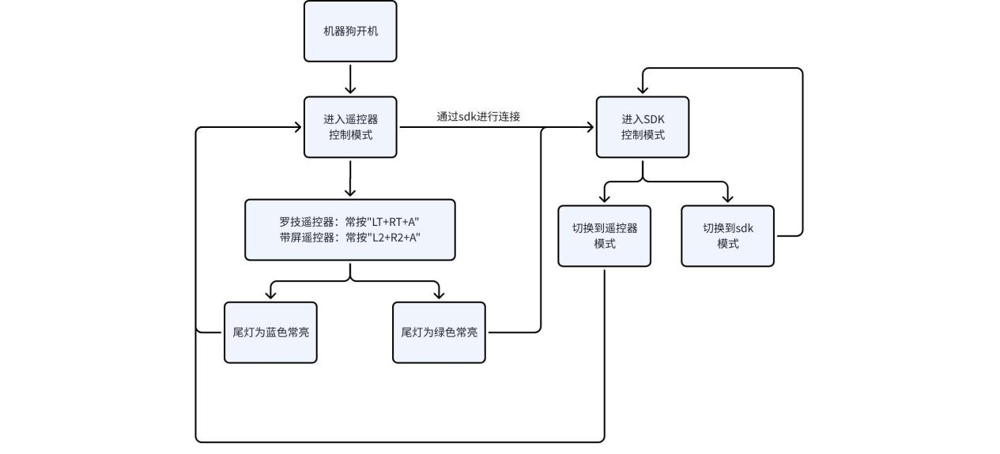

5.4 控制权切换功能
==================

适用于D1 Edu、D1 Ultra 型号四足机器人，用于说明遥控器和 sdk 控制之间切换控制权的使用方法

**不支持同时采用 sdk 和遥控器进行控制**

**采用 sdk 控制时，若电量较低，会自动将控制权切换至遥控器端**

5.4.1 版本要求
--------------

四足机器人固件版本：v0.2.5 及以上

遥控器 app 软件版本：v2.4.5 及以上(D1 Ultra)

5.4.2 功能说明
--------------

| 控制端         | 如何切换                     | 灯语说明           |
|---------------|-----------------------------|-------------------|
| 罗技手柄遥控器 | 长按 `LT+RT+A`   | 四足机器人尾灯常蓝 |
| 带屏遥控器     | 长按 `L2+R2+A`   | 四足机器人尾灯常蓝 |
| SDK端CPP       | 切换到 SDK 模式：     `zsibot_exec.SetCmd(CmdCode::CMD_SDK_CONTROL_RIGHT);`  切换到遥控器模式：     `zsibot_exec.SetCmd(CmdCode::CMD_REMOTE_CONTROL_RIGHT);`           | 四足机器人尾灯常绿 |

5.4.3 控制框图
--------------

