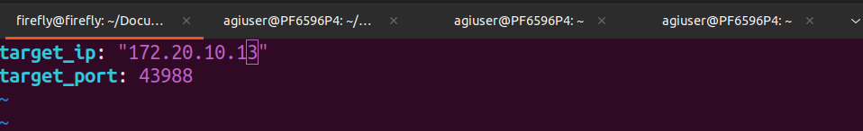
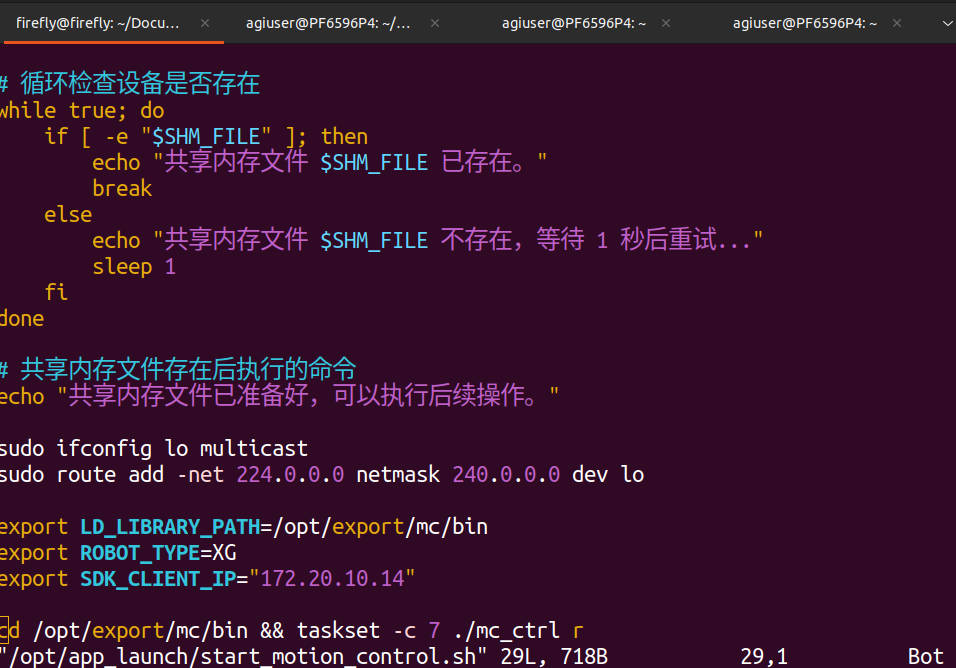
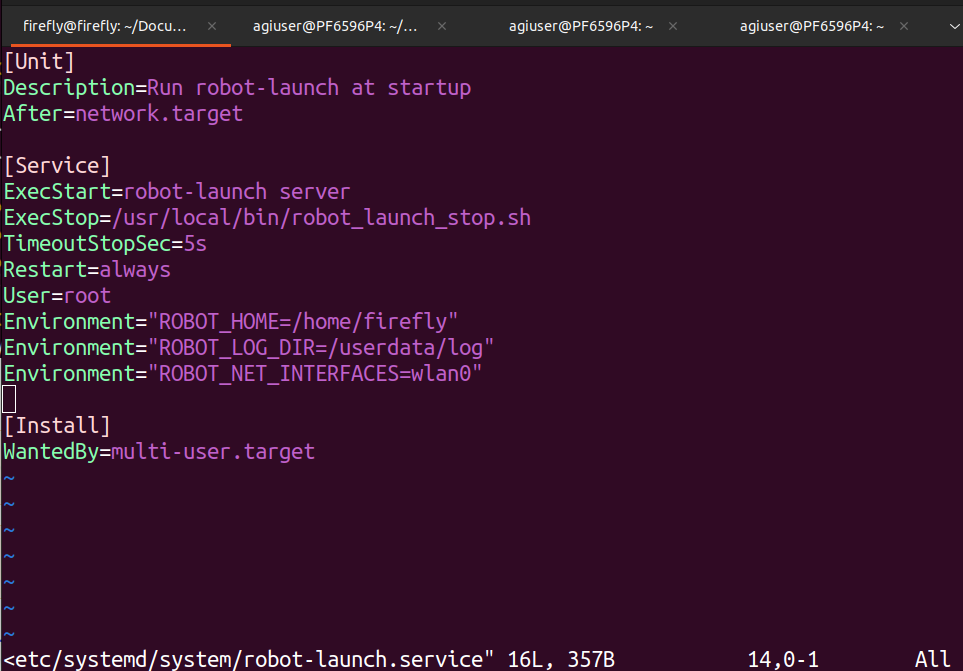

5.5 连接外部wifi
================

step1.使用nmcli指令将四足机器人连接到外部wifi
---------------------------------------------

```
ssh firefly@192.168.234.1
sudo nmcli device wifi connect <wifi_name> passward <wifi_passward>
ping 8.8.8.8
```

step2.登录四足机器人本体
------------------------

ifconfig查看四足机器人wlan0的ip，并将本机连接到四足机器人同一个wifi，使用ssh登录四足机器人本体

**eg：四足机器人本体IP：172.20.10.14 用户控制端IP：172.20.10.13**

```
ssh firefly@172.20.10.14    #密码firefly
```

step3.修改四足机器人本体配置
----------------------------

```
sudo vim /opt/export/config/sdk_config.yaml
sudo vim /opt/app_launch/start_motion_control.sh
sudo vim /etc/systemd/system/robot-launch.service
sudo reboot    #重启后生效
```







-   **这里使用非 192.168.234.X 网段 IP 控制设备，因此需要配置/opt/app\_launch/start\_motion\_control.sh**
-   **使用wlan0网口，因此需要配置/etc/systemd/system/robot-launch.service为wlan0**

step4.终端修改cpp/python文件的ip配置，编译并执行
------------------------------------------------

```
app.initRobot("172.20.10.14", 43988, "172.20.10.13")    #local_ip, local_port, dog_ip
```

```
constexpr int CLIENT_PORT = 43988;   // local port
std::string CLIENT_IP = "172.20.10.14"; // local IP address
std::string DOG_IP = "172.20.10.13";    // dog ip
```

编译执行同 [3.9示例Demo运行步骤](3.9示例Demo运行步骤.md)
