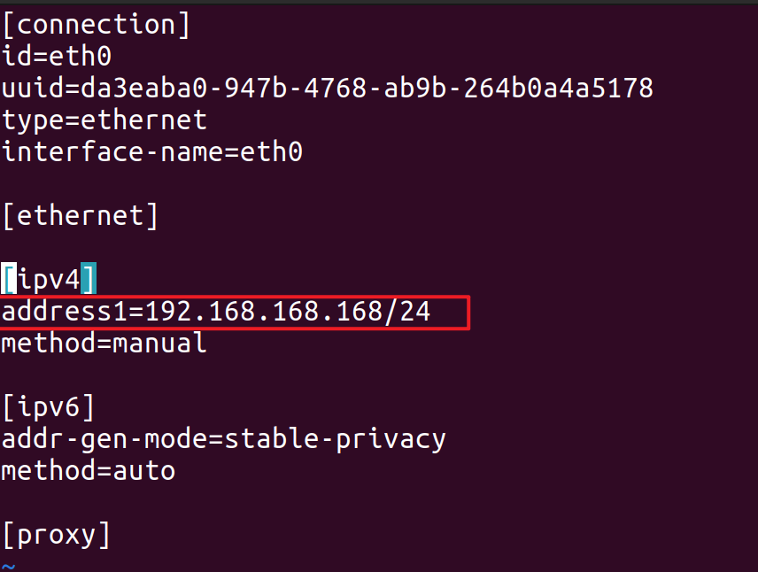
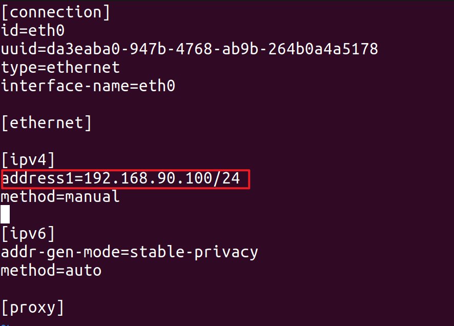

5.6 修改有线网口IP地址
======================

step1.使用终端工具或 ssh 工具进入四足机器人
-------------------------------------------

```
ssh firefly@192.168.234.1  
```

step2.编辑 eth0 的配置文件
--------------------------

```
sudo vim /etc/NetworkManager/system-connections/eth0.nmconnection 
```

如果要修改四足机器人的RJ45口的IP地址， 修改 `address1=192.168.168.168/24` 为你需要修改的IP，例如 `192.168.90.100/24`





step3.重启四足机器人，配置生效
------------------------------
