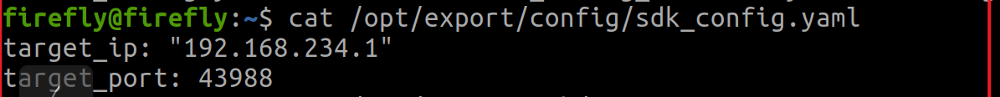

5.7 在机器人本体运行SDK
=======================

step1.将 sdk 拷贝到机器人本体内
-------------------------------

```
sudo scp -r /home/username/Documents/agibot_D1_Edu-Ultra_v0.2.7/agibot_D1_Edu-Ultra firefly@192.168.234.1:/home/firefly/Documents
```

step2.登录到机器人本体
----------------------

```
ssh firefly@192.168.234.1
```

step3.修改 sdk 配置文件
-----------------------

```
sudo vim /opt/export/config/sdk_config.yaml
```

修改为:



修改后，重启机器人

step4.修改和编译 sdk 文件
-------------------------

修改python或C++脚本初始化机器人连接时的IP地址，local\_ip和dog\_ip均设置为\"192.168.234.1\"

```
#python
app.initRobot("192.168.234.1",43988,"192.168.234.1") ##local_ip, local_port, dog_ip

#C++
constexpr int CLIENT_PORT = 43988;    // local port
std::string CLIENT_IP = "192.168.234.1"; // local IP address
std::string DOG_IP = "192.168.234.1";    // dog ip
```

编译：

```
cd /home/agiuser/Documents/agibot_D1_Edu-Ultra_v0.2.7/agibot_D1_Edu-Ultra/demo/zsl-1/cpp
mkdir build
cd build
cmake ..
make -j6
```

step5.运行 demo 示例
--------------------

```
cd demo/zsl-1/python/examples
python highlevel_demo.py
or
python lowlevel_demo.py
```
