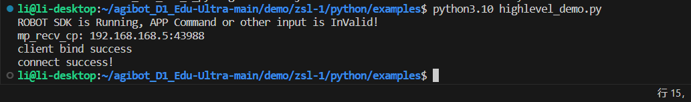

六、FAQ
=======

**6.1：connect time out**

运行 SDK 程序后存在连接超时，提示信息为：

```
client bind success
connect time out
error async receive from
```

1.  请按照文档修改 SDK 配置文件中 target\_ip 参数。
2.  若与设备通讯采用非 WiFi 直连，还需按照文档修改 SDK\_CLIENT\_IP 参数。非 WiFi 直连时，设备会有概率出现运控绑定 SDK 失败，请按照文档有线连接绑定 IP 失败修改参数。

**6.2：有线连接绑定 IP 失败**

在配置SDK\_CLIENT\_IP后，若使用 wlan0 网络或者 eth0 网络进行 SDK 控制时，会存在设备开机后网络未初始化完成，对应网卡未分配 IP 地址，导致运控程序绑定 IP 地址失败。

具体表现为 SDK 程序运行后提示：connect time out，通过登录设备主控后，执行命令 `sudo lsof -i -P -n -c mc_ctrl | grep 43997` 查看输出内容，运控对应端口未被绑定。

通过修改设备主控内
`/etc/systemd/system/robot-launch.service`
文件配置可修复，在 Service 里面添加一行
`Environment="ROBOT_NET_INTERFACES=wlan0"`
其中wlan0为对应网卡名称，若使用有线网络可修改为eth0。

完整配置文件如下：

```
[Unit]
Description=Run robot-launch at startup
After=network.target

[Service]
ExecStart=robot-launch server
ExecStop=/usr/local/bin/robot_launch_stop.sh
TimeoutStopSec=5s
Restart=always
User=root
Environment="ROBOT_HOME=/home/firefly"
Environment="ROBOT_LOG_DIR=/userdata/log"
Environment="ROBOT_NET_INTERFACES=eth0"

[Install]
WantedBy=multi-user.target
```

-   **参数配置后需进行重启设备生效！**
-   **此参数配置后有概率导致四足机器人程序无法启动！**
-   **配置 ROBOT\_NET\_INTERFACES 后程序会检测所配置网卡是否被分配 IP，若网卡始终没有 IP，则会导致四足机器人程序无法启动。**

**6.3：使用 wlan0 连接环境 wifi，每次重启设备都不会自动连接**

设备上 AP 与 wlan 网卡存在冲突，部分版本有清除自动连接功能，若需要关闭清除自动连接功能，可执行以下命令：

```
sudo systemctl stop networkmanager-cleanup.service      //关闭网络清除服务
sudo systemctl disable networkmanager-cleanup.service   //禁用网络清除服务
```

**6.4： Python 导入失败**

确认脚本是否将 `lib/<model\>/<arch\>` 加入`sys.path`；

Python 版本需与扩展模块匹配，python 版本必须为 3.1.0 版本；



**6.5： C++ 链接失败？**

确认 `lib/\<model\>/\<arch\>` 中存在对应 .so 文件；

确保 CMake 检测到正确架构（x86\_64 / aarch64）。

**6.6： 运控中获取设备状态获取接口支持频率？**

lowlevel 的 500hz， highlevel 的 50hz。

**6.7： SDK 中控制接口支持频率？**

控制数据最大可以支持 500hz 发送，一般来说 20～50hz 就可以保证设备稳定运行。

**6.8： SDK 程序是否为线程安全？**

SDK 程序为线程安全。

**6.9： SDK 是否存在通讯检测？**

运控程序会检测是否持续收到 SDK 数据，若 3 秒内未收到数据，则认为 SDK 通讯中断，设备会自动切换阻尼模式趴下。

**6.10： 在机器内通过 service 启动运控程序时，如何避免机器自身程序未启动？**

service 中 After 参数可以配置为 robot-launch，robot-launch 服务会启动机器自身程序。

**6.11： 手柄遥控和 sdk 遥控可以同时切换吗？**

当前版本 SDK 优先级高于手柄遥控，无法同时切换。

**6.12： 获取到的 IMU 数据是否是原始数据？**

获取到的 IMU 数据是原始数据。

**6.13： 获取到的 IMU 数据感觉存在误差？**

设备体内 IMU 数据受产品型号影响，精度存在误差，若对 IMU 精度有更高要求，需要单独采购高精度 IMU 在上身使用。

**6.14： 使用过SDK控制后，再使用手柄遥控控制设备时，发送站立指令为什么设备会原地做'俯卧撑'**

如果配置过 SDK\_CLIENT\_IP 参数，则运控启动时会绑定对应IP，若IP不存在，则会导致此现象。

**6.15： 四元数转换为欧拉角时，旋转顺序是什么？**

欧拉角顺序为 ZYX，即先 Z 轴旋转，再 Y 轴旋转，最后 X 轴旋转。

**6.16： Highlevel 与 Lowlevel 可以同时使用吗？**

Highlevel 与 Lowlevel 不可以同时使用，且在切换两种接口时，要预留一定时间等待设备端口释放。

**6.17： 为什么运控程序升级后，SDK 无法控制设备？**

运控程序升级后，运控相关配置会被覆盖，需要重新配置 SDK\_CONFIG 与SDK\_CLIENT\_IP 参数。

**6.18： 是否有 ROS 接口？**

暂无 ROS 接口。

**6.19： 使用 SDK 时，程序卡在 initRobot 函数不往下执行了？**

SDK 依赖 boost 1.74.0 版本，若使用版本过旧，可能存在结构体变化导致的兼容性问题。

**6.20：是否支持在四足机器人本体部署控制逻辑**

不建议在四足机器人本体部署控制逻辑，四足机器人内部无多余算力

**6.21：升级后找不到四足机器人本体的WIFI**

有可能是因为升级导致四足机器人WIFI名发生了更改，可在 `/userdata/bak/system/hostapd.conf` 文件处进行WIFI名的查看和修改
